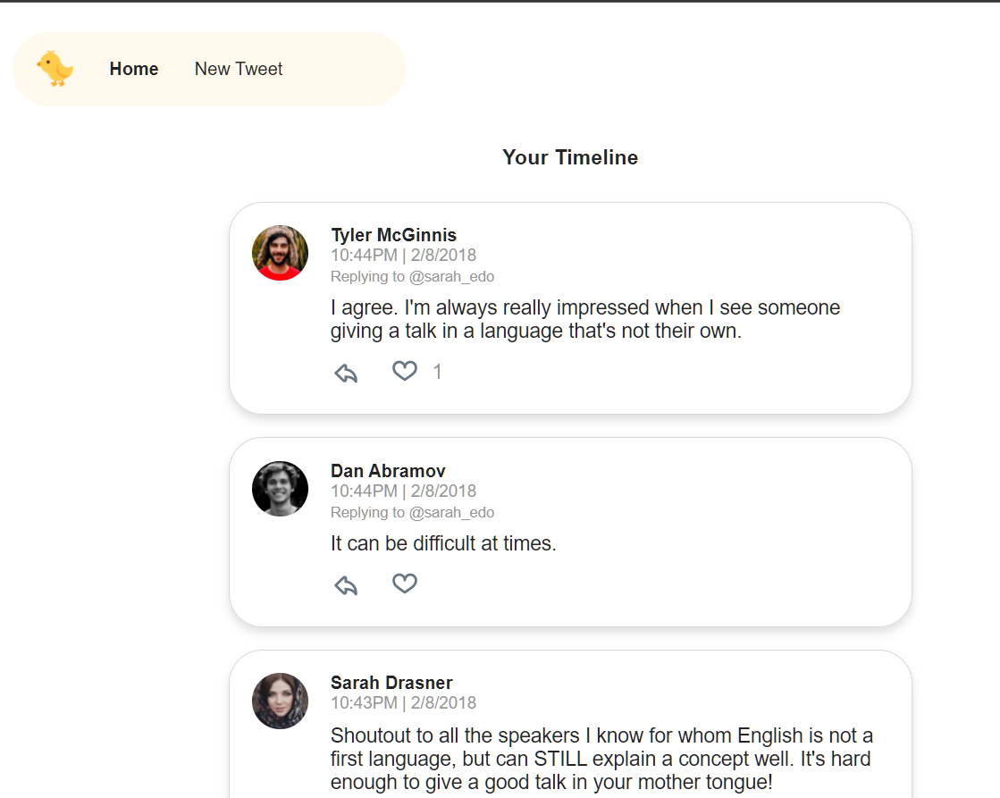
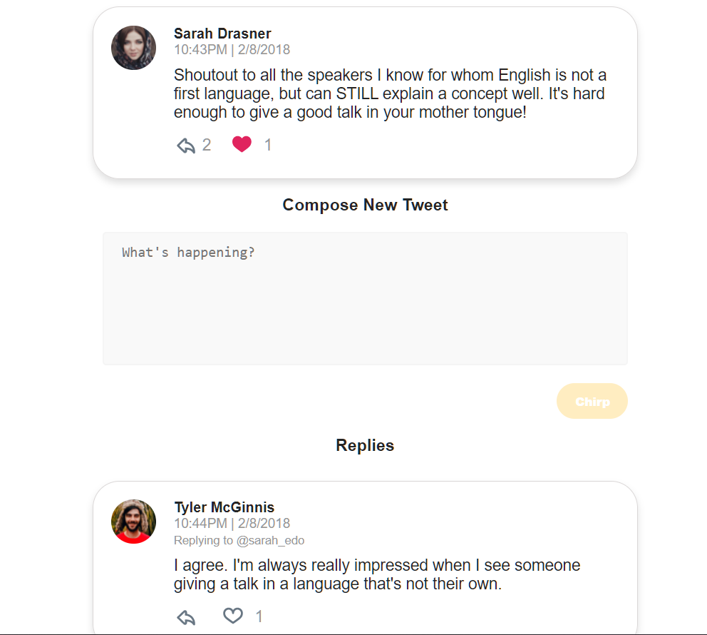
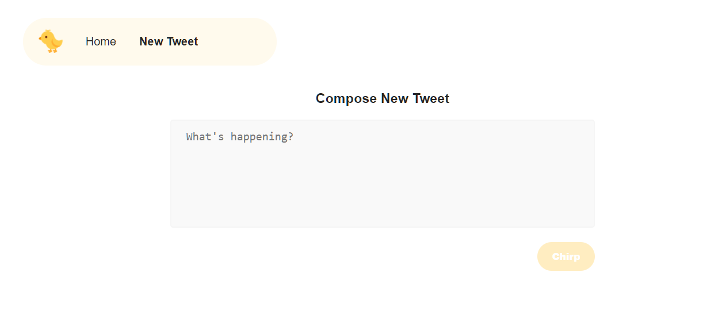

---
# Chirper Project

Chirper is a Twitter-like application that allows a user to tweet, like, reply, & navigate a timeline of posts.

It's built using React, Redux, React Router, & Redux Thunk.

It is part of Udacity's [React Nanodegree program](https://www.udacity.com/course/react-nanodegree--nd019).

---
## Project Setup

Clone the Project 
```bash
git clone https://github.com/Ahmedashref26/Chirper.git
``` 
Install the dependencies 
```bash
npm install
```

---
## Usage

Start the development server.

```bash
npm start
```

View app at

- [http://localhost:3000](http://localhost:3000)

What you can do with this application

- post new tweets
- reply to tweets
- like tweets

[](./public/img/chirper-main.png)
[](./public/img/chirper-reply.png)
[](./public/img/chirper-new.png)

---
## License

MIT
